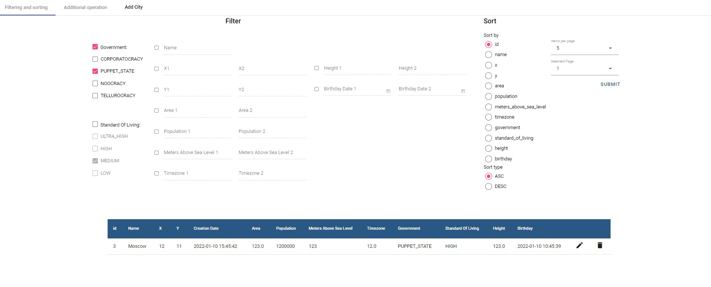
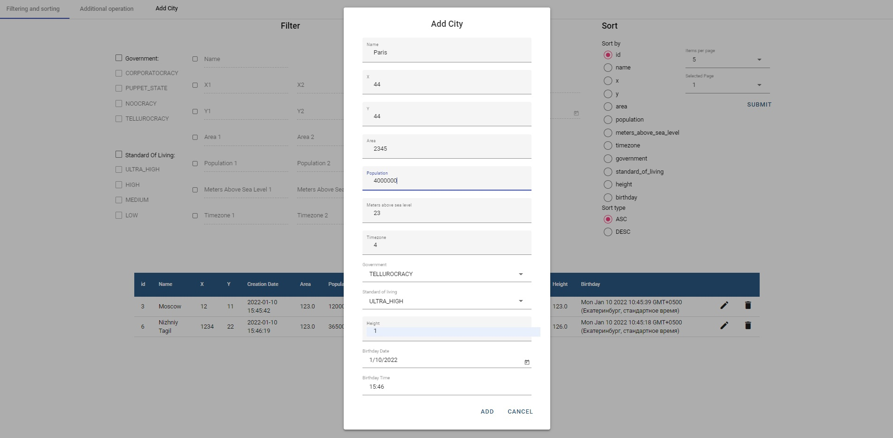
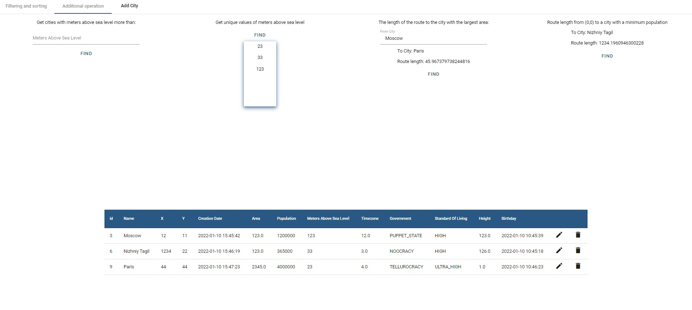
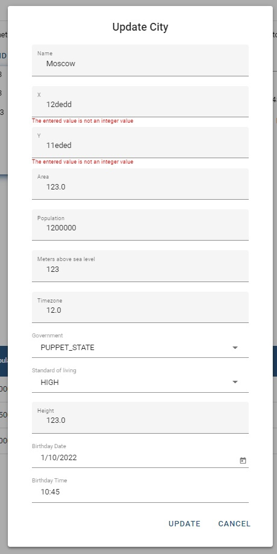

## Лабораторная работа #2 Сервис-ориентированная архитектура. Клиентская часть.

### Главная страница с возможностью сортировки и фильтрования городов.

### Диалоговое окно добавления города

### Дополнительные операции

### Валидация форм ввода

Запуск:

в папке soa-lab2-front в консоли вводим npm install(установка необходимых модулей),
затем ng serve --open
